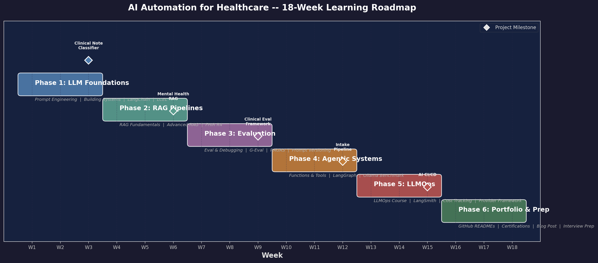
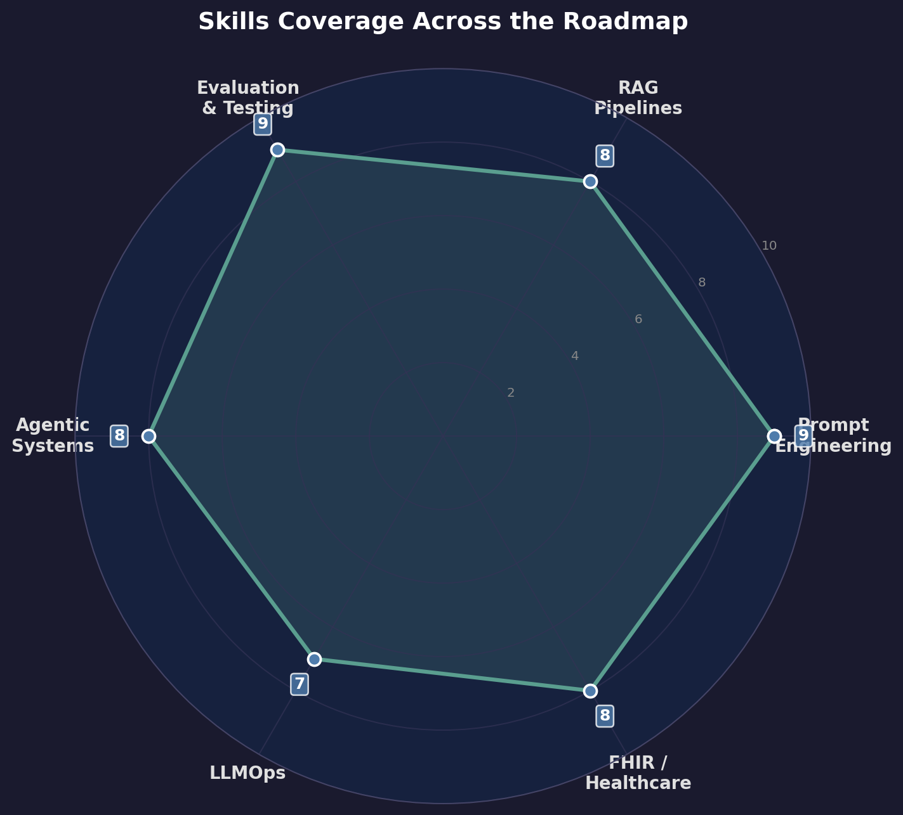
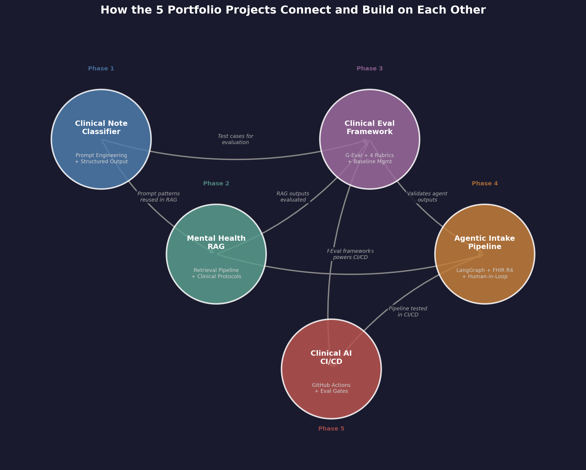
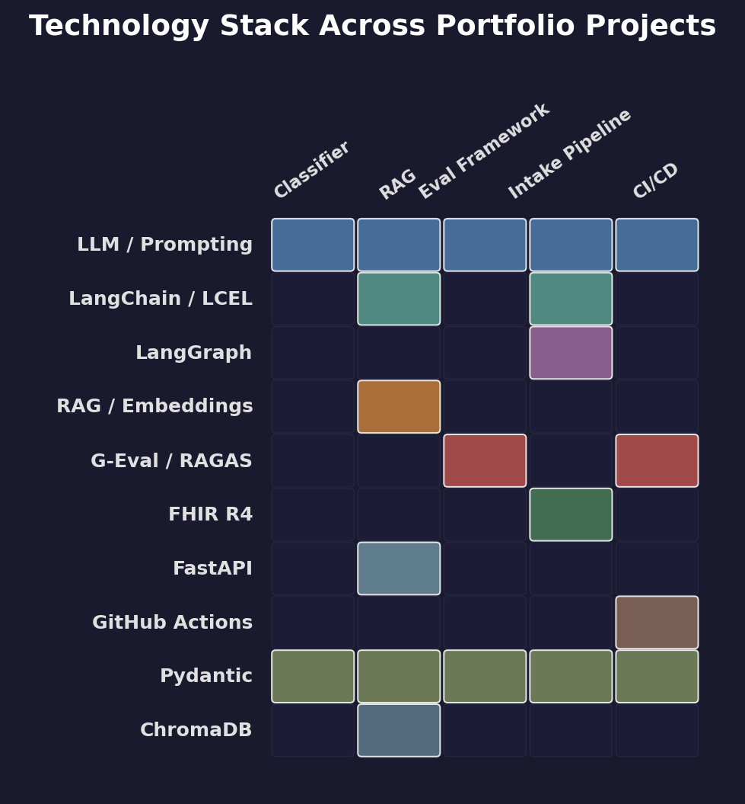

# AI Automation for Healthcare -- Learning Roadmap


---

After 15 years in software engineering -- building hospital information systems, FHIR interoperability layers, and clinical data platforms -- I spent 18 weeks systematically learning AI automation and applying it to healthcare. This repository is the consolidated record of that journey: every course note, code example, implementation pattern, and portfolio artifact organized into a single navigable structure.

The transition was not from zero. It was from deep domain expertise in healthcare systems to deep technical competence in LLM pipelines, evaluation frameworks, agentic architectures, and LLMOps infrastructure. The 20 modules in this repo cover the full stack of skills needed to build AI systems that work inside clinical workflows, where wrong outputs have real consequences and "it usually works" is not good enough.

---

## Roadmap Overview

<p align="center">
  
</p>

## Skills Coverage

<p align="center">
  
</p>

---

## What I Can Do Now

The 20 modules and 5 portfolio projects translate into concrete, demonstrable capabilities for building AI systems in clinical environments.

| Capability | Modules | Demonstrated In | What It Means |
|------------|---------|-----------------|---------------|
| **Build LLM classification pipelines with structured clinical output** | 01, 02, 04 | [clinical-note-classifier](https://github.com/kavoshm/clinical-note-classifier) | Take a free-text clinical note, produce validated JSON with urgency level, ICD-10 codes, and reasoning trail. Production-grade error handling with safety-first fallbacks. |
| **Build RAG systems over sensitive clinical documents** | 05, 06 | [mental-health-rag](https://github.com/kavoshm/mental-health-rag) | Ingest therapy transcripts, retrieve relevant sessions by clinical similarity, generate structured summaries with risk assessment and anti-hallucination guardrails. |
| **Build FHIR-compliant data pipelines from unstructured clinical text** | 07, 12, 13 | [clinical-intake-pipeline](https://github.com/kavoshm/clinical-intake-pipeline) | Multi-agent system that reads a raw clinical note and outputs a validated FHIR R4 Bundle with Patient, Condition, MedicationStatement, and AllergyIntolerance resources. |
| **Build automated evaluation frameworks for clinical AI** | 08, 09, 10, 11 | [clinical-eval-framework](https://github.com/kavoshm/clinical-eval-framework) | Score LLM-generated clinical outputs on accuracy, safety, completeness, and appropriateness using LLM-as-judge with domain-specific rubrics. Detect regressions across prompt versions. |
| **Build CI/CD pipelines with LLM evaluation gates** | 15, 16, 17, 18 | [clinical-ai-cicd](https://github.com/kavoshm/clinical-ai-cicd) | GitHub Actions workflow that blocks PR merges when clinical quality drops. Prompt changes are versioned, tested, and evaluated like code changes. |
| **Evaluate cost/quality tradeoffs across LLM providers** | 14, 17, 18 | [clinical-ai-cicd](https://github.com/kavoshm/clinical-ai-cicd) | Benchmark local models (Ollama) against cloud APIs, track cost per clinical classification, and make data-driven model selection decisions. |

---

## Table of Contents

### Phase 1: LLM Foundations (Weeks 1--3)
| # | Module | Description | Applied In |
|---|--------|-------------|------------|
| 01 | [Prompt Engineering](https://github.com/kavoshm/prompt-engineering) | System prompts, few-shot, chain-of-thought, output formatting | [clinical-note-classifier](https://github.com/kavoshm/clinical-note-classifier) -- chain-of-thought triage, few-shot ICD-10 coding |
| 02 | [Building Systems with LLMs](https://github.com/kavoshm/building-systems) | Chained prompts, classification pipelines, moderation layers | [clinical-note-classifier](https://github.com/kavoshm/clinical-note-classifier) -- multi-step classification with safety fallbacks |
| 03 | [LangChain Development](https://github.com/kavoshm/langchain) | Chains, memory, basic agents | [mental-health-rag](https://github.com/kavoshm/mental-health-rag) -- LangChain document loaders and retrieval chains |
| 04 | [LCEL (LangChain Expression Language)](https://github.com/kavoshm/lcel) | Declarative chains, parallel execution, streaming | [clinical-intake-pipeline](https://github.com/kavoshm/clinical-intake-pipeline) -- declarative chain composition in agent nodes |

### Phase 2: RAG Pipelines (Weeks 4--6)
| # | Module | Description | Applied In |
|---|--------|-------------|------------|
| 05 | [RAG Fundamentals](https://github.com/kavoshm/rag-fundamentals) | Document loading, text splitting, vector store basics | [mental-health-rag](https://github.com/kavoshm/mental-health-rag) -- dialogue-aware chunking, ChromaDB ingestion |
| 06 | [Advanced RAG](https://github.com/kavoshm/advanced-rag) | Sentence window retrieval, auto-merge, RAG triad evaluation | [mental-health-rag](https://github.com/kavoshm/mental-health-rag) -- risk-focused retrieval, metadata filtering |
| 07 | [FHIR R4 for AI](https://github.com/kavoshm/fhir-r4) | Healthcare data standards, LLM-to-FHIR mapping, validation | [clinical-intake-pipeline](https://github.com/kavoshm/clinical-intake-pipeline) -- FHIR R4 Bundle generation with ICD-10/SNOMED coding |

### Phase 3: Evaluation (Weeks 7--9)
| # | Module | Description | Applied In |
|---|--------|-------------|------------|
| 08 | [Evaluation & Debugging](https://github.com/kavoshm/eval-debugging) | Eval patterns, tracing, systematic debugging | [clinical-eval-framework](https://github.com/kavoshm/clinical-eval-framework) -- evaluation pipeline architecture |
| 09 | [G-Eval Paper Implementation](https://github.com/kavoshm/g-eval) | LLM-as-judge, clinical criteria, probability-weighted scoring | [clinical-eval-framework](https://github.com/kavoshm/clinical-eval-framework) -- 4-rubric LLM-as-judge with CoT scoring |
| 10 | [RAGAS Framework](https://github.com/kavoshm/ragas) | RAG evaluation metrics, custom metrics, benchmarking | [clinical-eval-framework](https://github.com/kavoshm/clinical-eval-framework) -- retrieval quality metrics for RAG outputs |
| 11 | [Prompt Versioning](https://github.com/kavoshm/prompt-versioning) | Version management, diff tools, regression tracking | [clinical-ai-cicd](https://github.com/kavoshm/clinical-ai-cicd) -- baseline versioning and regression detection |

### Phase 4: Agentic Systems (Weeks 10--12)
| # | Module | Description | Applied In |
|---|--------|-------------|------------|
| 12 | [Agentic Fundamentals](https://github.com/kavoshm/agentic-fundamentals) | Function calling, custom tools, ReAct agents | [clinical-intake-pipeline](https://github.com/kavoshm/clinical-intake-pipeline) -- specialized extraction and validation agents |
| 13 | [LangGraph](https://github.com/kavoshm/langgraph) | State graphs, conditional routing, human-in-the-loop | [clinical-intake-pipeline](https://github.com/kavoshm/clinical-intake-pipeline) -- state graph with ambiguity-driven human review |
| 14 | [Ollama Benchmark](https://github.com/kavoshm/ollama-benchmark) | Local model benchmarking, latency comparison | [clinical-ai-cicd](https://github.com/kavoshm/clinical-ai-cicd) -- model selection data for cost/quality tradeoffs |

### Phase 5: LLMOps (Weeks 13--15)
| # | Module | Description | Applied In |
|---|--------|-------------|------------|
| 15 | [LLMOps Course](https://github.com/kavoshm/llmops-course) | Pipeline versioning, automated testing, deployment patterns | [clinical-ai-cicd](https://github.com/kavoshm/clinical-ai-cicd) -- GitHub Actions evaluation workflow |
| 16 | [LangSmith Tracing](https://github.com/kavoshm/langsmith-tracing) | Trace decorators, trace analysis, debug workflows | [clinical-eval-framework](https://github.com/kavoshm/clinical-eval-framework) -- trace-level debugging of eval scoring |
| 17 | [Cost & Latency Tracking](https://github.com/kavoshm/cost-tracking) | Token tracking, cost calculation, dashboards | [clinical-ai-cicd](https://github.com/kavoshm/clinical-ai-cicd) -- per-run cost tracking in CI pipeline |
| 18 | [Provider Framework](https://github.com/kavoshm/provider-framework) | Multi-provider benchmarking, cost analysis | [clinical-ai-cicd](https://github.com/kavoshm/clinical-ai-cicd) -- model comparison data for baseline decisions |

### Phase 6: Portfolio & Interview Prep (Weeks 16--18)
| # | Module | Description | Applied In |
|---|--------|-------------|------------|
| 19 | [Portfolio Materials](https://github.com/kavoshm/portfolio) | Blog post, project READMEs, cert study notes, GitHub profile | All 5 repos -- architecture diagrams, documentation, blog post |
| 20 | [Interview Preparation](https://github.com/kavoshm/interview-prep) | Resume defense, technical Q&A, behavioral, system design | Cross-cutting -- system design scenarios drawn from all projects |

---

## Featured Projects

Five standalone repositories were built during this roadmap, each applying the skills from multiple phases to a real healthcare AI problem:

| Project | Repository | Phase | What It Does |
|---------|-----------|-------|--------------|
| **Clinical Note Classifier** | [clinical-note-classifier](https://github.com/kavoshm/clinical-note-classifier) | 1 | LLM-powered triage classification with chain-of-thought reasoning, few-shot prompting, and structured JSON output |
| **Mental Health RAG** | [mental-health-rag](https://github.com/kavoshm/mental-health-rag) | 2 | RAG system for querying clinical treatment protocols with citation-backed answers, ChromaDB retrieval, and FastAPI |
| **Clinical Eval Framework** | [clinical-eval-framework](https://github.com/kavoshm/clinical-eval-framework) | 3 | Automated quality scoring for LLM clinical outputs using G-Eval with 4 rubrics, baseline management, and regression detection |
| **Agentic Intake Pipeline** | [clinical-intake-pipeline](https://github.com/kavoshm/clinical-intake-pipeline) | 4 | Multi-agent extraction from clinical notes to FHIR R4 resources using LangGraph with human-in-the-loop validation |
| **Clinical AI CI/CD** | [clinical-ai-cicd](https://github.com/kavoshm/clinical-ai-cicd) | 5 | CI/CD pipeline for LLM applications with automated evaluation gates, baseline comparison, and PR-level quality reporting |

### How the Projects Connect

Each project builds on skills and patterns from previous phases. The Clinical Note Classifier's prompt patterns feed into the RAG system. The Eval Framework scores outputs from both the RAG and the Intake Pipeline. The CI/CD system integrates the Eval Framework to automate quality gates across all projects.

<p align="center">
  
</p>

---

## Technology Stack

<p align="center">
  
</p>

**Core technologies used across the roadmap:**

```
AI/LLM:        LangChain  |  LangGraph  |  OpenAI API  |  Azure OpenAI  |  Ollama
                RAG  |  G-Eval  |  LLM-as-Judge  |  RAGAS  |  Prompt Engineering

Healthcare:    FHIR R4  |  HL7 v2  |  ICD-10  |  SNOMED CT  |  LOINC
                Clinical NLP  |  EHR Integration  |  PHI/HIPAA

Engineering:   Python  |  Pydantic  |  FastAPI  |  ChromaDB  |  Docker
                GitHub Actions  |  LangSmith  |  pytest
```

---

## Framework Evolution: LangChain to LangGraph

The roadmap follows the real progression of the LangChain ecosystem, and each step exists for a reason.

**LangChain (Module 03)** -- The starting point. Chains, memory, and basic agents provided a high-level abstraction for LLM pipelines. Good for prototyping, but the implicit execution order and opaque memory management made debugging clinical pipelines difficult. When a chain silently dropped context from a patient note, tracing the failure through LangChain's abstraction layers took longer than it should have.

**LCEL (Module 04)** -- LangChain Expression Language replaced imperative chain construction with declarative composition using the pipe (`|`) operator. This was the right move: explicit data flow, native streaming, and parallel execution without boilerplate. The mental-health-rag retrieval chains became readable and testable. The limitation appeared when pipelines needed conditional branching -- LCEL handles linear flows well, but "if ambiguity score > 0.3, route to human review" required workarounds.

**LangGraph (Module 13)** -- State graphs with typed state, conditional edges, and first-class human-in-the-loop support. This is where the clinical-intake-pipeline lives. Each agent (extraction, validation, ambiguity detection, bundle writing) is a graph node with explicit state transitions. The `interrupt_before` mechanism for human review is not a hack -- it is a core graph primitive. For healthcare workflows where certain decisions require clinician approval, this distinction matters.

**When to use which:**
- **Direct OpenAI API** -- Single-call classification or extraction where you control the full prompt. Used in clinical-note-classifier.
- **LCEL** -- Linear retrieval-generation pipelines with clear input/output contracts. Used in mental-health-rag.
- **LangGraph** -- Multi-step workflows with branching, retry loops, or human checkpoints. Used in clinical-intake-pipeline.
- **The pattern:** Start with the simplest tool that handles your control flow. Move up only when you need conditional routing or stateful orchestration.

---

## How to Use This Repository

**If you are evaluating this portfolio:**
- Start with the [Featured Projects](#featured-projects) table above -- each links to a standalone repo with its own README, architecture, and results.
- Browse the [project connections diagram](#how-the-projects-connect) to understand how the projects build on each other.
- Read the [blog post](https://kavoshm.github.io/blog/llm-as-judge-healthcare.html) for a deep dive into the evaluation framework.

**If you are following a similar learning path:**
- Each module links to its own GitHub repository with a README, study notes, and working code examples.
- The modules are ordered sequentially -- concepts in later modules depend on earlier ones.
- Every code example is self-contained and can be read independently.

**If you want to regenerate the figures:**
```bash
pip install matplotlib numpy
python scripts/generate_figures.py
```

---

## Blog Post

> **"Why LLM-as-Judge Works Differently in Healthcare: Lessons from Building Clinical Evaluation Pipelines"**
>
> A three-word prompt change dropped our clinical summarization accuracy by 15%. Nobody noticed for 3 days. That incident is why I built an automated evaluation framework for LLM-generated clinical outputs.
>
> The post covers: why manual review fails, how G-Eval solves the "no gold standard" problem, 4 rubrics that work for healthcare, calibration challenges, honest failures, and 5 practical recommendations.

Read the full post: [kavoshm.github.io/blog/llm-as-judge-healthcare.html](https://kavoshm.github.io/blog/llm-as-judge-healthcare.html)

---

## Lessons Learned

Eighteen weeks of building clinical AI systems surfaced patterns that no course teaches upfront.

**Evaluation is not a phase -- it is the foundation.** I originally planned evaluation as Phase 3 (weeks 7-9). In practice, I needed it from week 1. The clinical-note-classifier had no way to measure whether prompt changes improved or degraded output quality until the eval framework existed. If I started over, I would build a minimal eval harness in week 1 and expand it as the projects grew. Every other module benefits from being able to measure its own impact.

**Structured output validation catches more failures than prompt engineering prevents.** The most dangerous LLM failures were not wrong answers -- they were outputs that looked correct but violated structural constraints (invalid ICD-10 codes, medications without dosages, FHIR resources with missing required fields). Pydantic validation at every pipeline boundary caught errors that no amount of prompt refinement could eliminate. The safety-first fallback pattern (default to highest urgency on parse failure) came from a real incident, not from a textbook.

**RAG anti-hallucination requires explicit prompt engineering, not just retrieval quality.** Good retrieval is necessary but not sufficient. The mental-health-rag system initially generated plausible-sounding clinical details that were not in the source transcripts. The fix was not better embeddings -- it was explicit prompt instructions: "Only report information present in the provided transcript. For any field not documented, state 'Not documented in this session.'" Retrieval gets the right context to the model. Prompting prevents the model from inventing beyond it.

**Human-in-the-loop is an architecture decision, not a feature toggle.** Adding human review to the clinical-intake-pipeline after the fact would have required a rewrite. LangGraph's `interrupt_before` works because the entire pipeline is designed around state checkpoints. The lesson: if a clinical workflow requires human approval at any point, design for it from the first commit.

**Cost tracking changes model selection decisions.** Module 17 started as an exercise. It became a decision tool. Running 1000 clinical notes through GPT-4o costs roughly 10x more than GPT-4o-mini, but the accuracy difference on structured classification tasks was under 3%. For the CI/CD pipeline, that data justified using the cheaper model for gate checks and reserving the expensive model for final evaluation. Without tracking, we would have defaulted to the expensive model and never questioned it.

---

## Learning Path Recommendation

For someone following a similar path into AI for healthcare, here is what I would recommend based on 18 weeks of experience.

**Recommended order (what worked):**

1. **Start with prompt engineering (Module 01) and build something immediately.** Do not spend weeks on theory. Write a clinical classifier in week 1. The hands-on failure modes teach more than any course lecture.
2. **Learn evaluation early (Modules 08-09) before you build anything complex.** You cannot improve what you cannot measure. A basic LLM-as-judge with one rubric takes a day to build and pays dividends for every subsequent module.
3. **Build RAG (Modules 05-06) before agentic systems (Modules 12-13).** RAG teaches you retrieval, context management, and output grounding -- all prerequisites for building agents that do not hallucinate.
4. **Learn FHIR (Module 07) in parallel with RAG, not separately.** Healthcare data standards are most useful when you have a pipeline to apply them to. Abstract FHIR study without a project is forgettable.
5. **End with LLMOps (Modules 15-18).** CI/CD, tracing, and cost tracking only make sense once you have multiple projects generating outputs that need to be monitored.

**What to skip or compress:**

- **LangChain basics (Module 03)** can be compressed to a few hours if you already know Python well. The framework changes fast enough that deep memorization of APIs is wasted effort. Learn the mental model (chains, retrievers, agents), then reference the docs.
- **Ollama benchmarking (Module 14)** is valuable but not blocking. Run it when you need to justify a model choice to a stakeholder. Do not let it delay your agentic systems work.

**What to add that I did not cover:**

- **Healthcare compliance (HIPAA, FDA SaMD guidance, 21 CFR Part 11).** I underestimated how often compliance comes up in technical interviews for healthcare AI roles. Even a surface-level understanding of HIPAA technical safeguards and the FDA's approach to Software as a Medical Device would have strengthened my portfolio.
- **Multi-modal clinical inputs.** Clinical data is not just text -- it includes lab PDFs, scanned forms, and imaging reports. A module on document OCR and multi-modal LLM inputs would bridge a real gap.
- **Deployment and inference optimization.** The roadmap stops at CI/CD. A production healthcare system also needs model serving, latency optimization, and failover strategies. This is the natural next step.

---

## About the Author

**Kavosh Monfared** -- Senior Software Engineer specializing in AI automation and healthcare systems.

15 years in software engineering. The last year spent deep in LLM pipelines, automated evaluation, and agentic systems for healthcare. Before that: hospital information systems, FHIR interoperability, and clinical data platforms.

**What I focus on:**
- **AI Evaluation & Quality** -- Automated evaluation frameworks for LLM-generated clinical outputs using G-Eval, LLM-as-judge, and domain-specific rubrics
- **Agentic Clinical Pipelines** -- Multi-step LLM chains that extract structured data from unstructured clinical notes, validate against medical terminologies, and write FHIR R4 resources
- **LLMOps for Healthcare** -- CI/CD pipelines that treat prompt changes like code changes: versioned, tested, evaluated, and blocked on regression

**Get in touch:**
- **GitHub:** [kavoshm](https://github.com/kavoshm)
- **LinkedIn:** [kavoshm](https://linkedin.com/in/kavoshm)
- **Email:** monfaredkavosh@gmail.com

---

## License

This project is licensed under the MIT License. See [LICENSE](LICENSE) for details.
